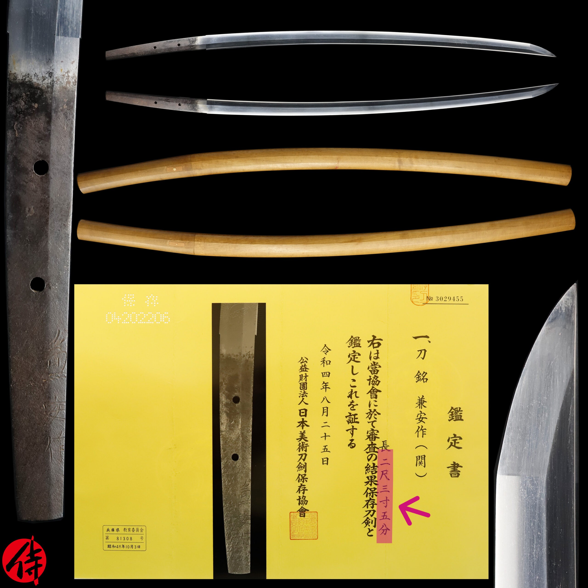

# Nihonto blade-length converter 

A CLI tool to convert traditional Japanese blade-length units to centimeters and vice versa. 
Many nihonto (traditional katana) use old units like 尺 (Shaku), 寸 (Sun), and 分 (Bu), and converting them can be time-consuming.

Below are the traditional Japanese units most commonly used for measuring blade length ("Nagasa"), these are still in use today, even for newly made swords:

- 尺(Shaku) = 30.3022 cm
- 寸(Sun) = 3.03022 cm
- 分(Bu) = 0.303022 cm 

For example, say you find a late Muromachi-period sword on a Japanese auction site marked “ニ尺三寸五分” (2 Shaku 3 Sun 5 Bu) on its NBTHK certificate (NBTHK stands for "Nihon Bijutsu Token Hozon Kyokai", or "Society for the Preservation of Japanese Art Swords"). You might want to know its length in centimeters. Or perhaps you already own another sword with a 71 cm blade and wish to compare. This tool provides quick and easy conversions for fellow Japanese sword collectors and enthusiasts.

*Photo courtesy of Samurai Museum Shop*  